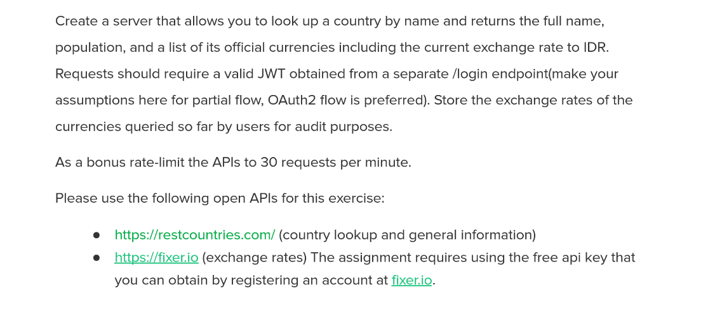

Spring Boot REST API Practices
========================================

### Features:

* JWT (Signin, Signup, Roles)
* REST API best practices
* Swagger Docs
* RestTemplate ( Consuming REST Services, a task implementation)
* API rate limiting with Bucket4j
* Task

*

### To-do Items
* Spring HATEOAS
* Spring Auto REST Docs

## Requirements

For building and running the application you need:

- JDK 8 or 11
- Maven 3

## Running the application locally

There are several ways to run a Spring Boot application on your local machine. One way is to execute the `main` method in the `de.codecentric.springbootsample.Application` class from your IDE.

Alternatively you can use the [Spring Boot Maven plugin](https://docs.spring.io/spring-boot/docs/current/reference/html/build-tool-plugins-maven-plugin.html) like so:

```shell
mvn spring-boot:run
```

Clone
--------

```sh
git clone git@github.com:syedabdullahrahman/spring-boot-jwt-assigment.git
```

Run
--------

```sh
cd spring-boot-jwt-assigment
```

```sh
mvn spring-boot:run
```

Access
--------

### Select

```
http://localhost:8080/
```

JSON Response:

```json

```

### Update

```

```

JSON Response:

```json

```


License
-------

MIT License


[spring-boot]: https://github.com/spring-projects/spring-boot
